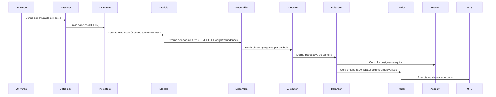
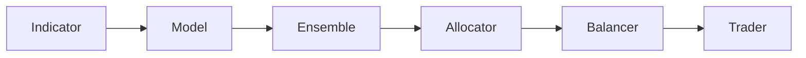

# 🜂 Tycherion v2 — Automated Trading Framework

**Tycherion** é uma arquitetura modular e extensível para automação de investimentos no MetaTrader 5 (MT5), construída em **Python** sob princípios de **arquitetura hexagonal** e **SOLID**.

---

## 📦 Objetivo

Fornecer um sistema de trading que:

- **Analisa** o mercado em tempo real usando dados históricos e indicadores.  
- **Decide** o que fazer (comprar, vender, segurar) com base em múltiplas estratégias.  
- **Gerencia** o portfólio de forma adaptativa, com políticas configuráveis de alocação e rebalanceamento.  
- **Opera** automaticamente no MetaTrader 5, com controle de risco e logs claros.

---

## ⚙️ Arquitetura Geral

O Tycherion é organizado em **camadas independentes**, seguindo o modelo **hexagonal** (Ports & Adapters):

```mermaid
graph TD

  subgraph Domain [Domain Layer]
    A1[Indicators] --> A2[Models]
  end

  subgraph Application [Application Layer]
    B1[Services]
    B2[Policies]
    B3[Runmodes]
    B4[Plugins Registry]
  end

  subgraph Ports [Ports Layer]
    P1[MarketDataPort]
    P2[TradingPort]
    P3[AccountPort]
    P4[UniversePort]
  end

  subgraph Adapters [Adapters Layer]
    C1[MT5MarketData]
    C2[MT5Trader]
    C3[MT5Account]
    C4[MT5Universe]
  end

  subgraph Shared [Shared Layer]
    S1[Config Loader]
    S2[Decorators]
  end

  A2 --> B1
  B1 --> B2
  B2 --> P1
  B2 --> P2
  B2 --> P3
  B4 --> B1

  P1 --> C1
  P2 --> C2
  P3 --> C3
  P4 --> C4

  S1 --> B3
  S2 --> C2

````  

---

## 🧩 Componentes Principais

### 1. **Domain Layer**

Contém a **lógica de análise** de mercado.

#### Indicators (`domain/indicators`)

Medições puras sobre o comportamento do preço (sem decisões).
Exemplos:

* Tendência (`trend_donchian`)
* Estiramento do preço (`stretch_zscore`)
* Volatilidade (`volatility_atr`)

Cada indicador é uma classe registrada via `@register_indicator`.

#### Models (`domain/models`)

Estratégias que **interpretam indicadores** e geram decisões.
Exemplo:

* `MeanReversion` → compra quando o preço está muito abaixo da média.
* `TrendFollowing` → compra quando há tendência de alta.

Cada modelo é uma classe com:

* `requires()` → indicadores necessários
* `decide()` → decisão BUY / SELL / HOLD + peso + confiança

---

### 2. **Application Layer**

É o **cérebro do sistema** — coordena tudo, define fluxos e políticas.

#### Services

Serviços genéricos:

* `ensemble.py` → combina sinais de vários models em um único sinal.
* `sizer.py` → converte pesos (0–1) em volumes válidos (respeitando regras MT5).
* `coverage_selector.py` → define o universo de ativos a monitorar.

#### Policies (`application/services/allocators` e `.../balancers`)

Decidem como **gerenciar o portfólio**:

```mermaid
flowchart LR
  S1[Signals por ativo] --> A1[Allocator]
  A1 --> A2[Target Weights]
  A2 --> B1[Balancer]
  B1 --> B2[Ordens]
  B2 --> T1[Trader]
```

* **Allocator** → transforma sinais em **pesos-alvo** de carteira.

  * Exemplo: `ProportionalAllocator` distribui o capital proporcional à força dos sinais.
  * Pode haver outras: `EqualWeightAllocator`, `RiskParityAllocator`, etc.

* **Balancer** → decide **quais trades executar** para mover a carteira ao alvo.

  * Exemplo: `ThresholdBalancer` só age se o peso for maior que um limite mínimo (reduz ruído).

Ambos são **plugins detectados automaticamente** via `@register_allocator` e `@register_balancer`.

#### Runmodes

Pontos de entrada do sistema:

* `live_multimodel.py` → modo contínuo, avalia sinais, executa alocação e envia ordens.
* Outros modos (ex: simulação, backtest) podem ser adicionados no futuro.

#### Plugins Registry

Gerencia o **descobrimento automático** de todos os componentes (indicators, models, allocators, balancers).
É responsável por montar dinamicamente o pipeline de execução.

---

### 3. **Ports Layer**

Interfaces que definem o contrato entre a aplicação e o mundo externo:

| Port             | Responsabilidade                         |
| ---------------- | ---------------------------------------- |
| `MarketDataPort` | Fornece candles (OHLCV) por símbolo.     |
| `TradingPort`    | Envia ordens (BUY/SELL) para o mercado.  |
| `AccountPort`    | Retorna saldo, equity e posições atuais. |
| `UniversePort`   | Lista os ativos disponíveis/visíveis.    |

Esses contratos permitem trocar o **backend** (MT5 → Binance, Alpaca, etc.) sem tocar na lógica central.

---

### 4. **Adapters Layer**

Implementações concretas dos Ports, aqui para **MetaTrader 5**:

| Adapter         | Implementa     | Responsabilidade                              |
| --------------- | -------------- | --------------------------------------------- |
| `MT5MarketData` | MarketDataPort | Lê candles históricos via `copy_rates_range`. |
| `MT5Trader`     | TradingPort    | Envia ordens reais/dry-run para o MT5.        |
| `MT5Account`    | AccountPort    | Consulta saldo e posições.                    |
| `MT5Universe`   | UniversePort   | Retorna símbolos visíveis ou por padrão.      |

Todos usam `MetaTrader5` (lib oficial) e respeitam o modo `dry_run` / `require_demo`.

---

### 5. **Shared Layer**

Ferramentas auxiliares:

* `config.py` → carrega YAML + `.env` e monta um `AppConfig` Pydantic.
* `decorators.py` → decoradores utilitários (`@demo_only`, `@logged`).

---

## 🔁 Fluxo de Execução (conceitual)



---

## 🧠 Flexibilidade e Extensibilidade

O Tycherion foi desenhado para crescer horizontalmente — **sem refatorações**.
Toda nova ideia vira apenas **um novo plugin**.

| O que adicionar                  | Onde colocar                       | Como registrar                                  |
| -------------------------------- | ---------------------------------- | ----------------------------------------------- |
| Novo indicador                   | `domain/indicators/`               | `@register_indicator(key="...", method="...")`  |
| Nova estratégia (model)          | `domain/models/`                   | `@register_model(name="...")`                   |
| Nova política de alocação        | `application/services/allocators/` | `@register_allocator(name="...")`               |
| Nova política de rebalanceamento | `application/services/balancers/`  | `@register_balancer(name="...")`                |
| Novo modo de execução            | `application/runmodes/`            | Chamado via `application.run_mode.name` no YAML |

Tudo é **auto-descoberto** em tempo de execução.

---

## 🪄 Níveis de Decisão

Cada camada de decisão é independente e substituível:



* **Indicator**: mede.
* **Model**: decide por ativo.
* **Ensemble**: junta modelos.
* **Allocator**: distribui capital.
* **Balancer**: gera ordens.
* **Trader**: executa.

---

## 🧱 Estrutura de Pastas

```
tycherion/
├── adapters/
│   └── mt5/
│       ├── market_data_mt5.py
│       ├── trading_mt5.py
│       ├── account_mt5.py
│       └── universe_mt5.py
├── application/
│   ├── plugins/registry.py
│   ├── runmodes/live_multimodel.py
│   └── services/
│       ├── ensemble.py
│       ├── sizer.py
│       ├── coverage_selector.py
│       ├── allocators/
│       └── balancers/
├── domain/
│   ├── indicators/
│   └── models/
├── ports/
│   ├── market_data.py
│   ├── trading.py
│   ├── account.py
│   └── universe.py
├── shared/
│   ├── config.py
│   └── decorators.py
└── app/
    └── main.py
```

---

## 🧭 Filosofia de Design

* **Hexagonal**: lógica central independe de infraestrutura.
* **SOLID**: cada componente tem uma só responsabilidade.
* **Plugável**: novos comportamentos = novos módulos, nunca refatoração.
* **Transparente**: logs claros e execução rastreável.
* **Seguro**: suporte a dry-run, DEMO-only e `thresholds` anti-ruído.

---

## 🧩 Próximos Passos

1. **Portfolio-aware Sizing** → considerar equity e risco real por trade.
2. **Stack de Allocation/Rebalance** → múltiplas policies em sequência (TopK, CashBuffer, etc).
3. **Broker unificado** → expor Account + Trader num único port.
4. **Visual dashboards** para acompanhamento dos sinais e execuções.

---

## 🜍 Licença

Uso pessoal e educacional — sem garantias.
Inspirado em conceitos de trading algorítmico, IA financeira e arquitetura limpa.
