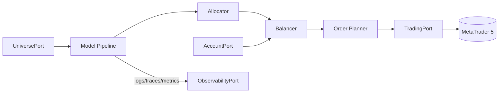

# Tycherion - Automated Trading Framework

Tycherion is a modular Python framework for algorithmic trading on MetaTrader 5 (MT5), built with hexagonal architecture, auto-discovered plugins, and first-class observability.

## Quick Links

- Full documentation: [docs/README.md](./docs/README.md)
- Quickstart: [docs/guides/quickstart.md](./docs/guides/quickstart.md)
- Observability guide: [docs/guides/observability.md](./docs/guides/observability.md)
- Demo config: [configs/demo.yaml](./configs/demo.yaml)

## Quick Start

### Prerequisites

- Python 3.10+ and `pip`
- MetaTrader 5 installed on the same machine
- Demo credentials recommended for local validation

### Installation

```powershell
python -m venv .venv
.\.venv\Scripts\activate
pip install -e .
```

### Configuration

- Copy baseline config: `copy configs\demo.yaml configs\local.yaml`
- Fill `mt5.*` fields and adjust `application.coverage` symbols
- Use `observability:` as canonical YAML key (`telemetry:` is deprecated alias)
- Prefer environment variables for secrets (`MT5_*`)

### Run

- Demo baseline: `python scripts/run_demo.py`
- Custom config: `python -c "from tycherion.bootstrap.main import run_app; run_app('configs/local.yaml')"`

## Architecture in One Minute



- Domain: indicators, signal models, portfolio logic.
- Application: orchestration, run modes, and services.
- Ports: stable contracts for market/trading/account/universe/observability.
- Adapters: concrete MT5 and OTel/Noop implementations.

## Key Paths

- `src/tycherion/bootstrap/main.py` - app wiring and run mode dispatch
- `src/tycherion/application/runmodes/live_multimodel.py` - live loop
- `src/tycherion/application/pipeline/` - pipeline configuration and execution
- `src/tycherion/domain/` - indicators, models, allocators, balancers
- `src/tycherion/ports/` - stable contracts
- `src/tycherion/adapters/` - integrations
- `docs/` - architecture, guides, references, runbooks, ADRs

## Security

- Never commit `.env` or secrets.
- Keep credentials in local `.env` or CI secret stores.
- Rotate credentials immediately if exposure is suspected.

## License

Personal and educational use, no warranty.
