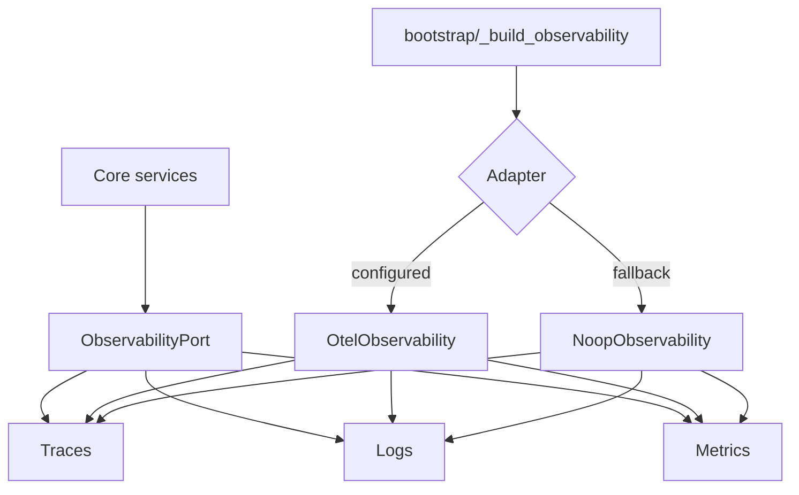

# Observability Architecture

Audience: developers and SRE.
Goal: define observability boundaries, signal semantics, and fallback behavior.

## If You Need

- Setup and quick validation: [Observability Guide](../guides/observability.md).
- Exact config keys and defaults: [Observability Config Reference](../reference/observability/config.md).
- Instrumentation examples: [Observability Instrumentation](../reference/observability/instrumentation.md).
- Incident response: [Observability Runbook](../runbooks/observability.md).

## Purpose

Keep core trading logic independent from observability infrastructure while preserving full operational visibility.

## Topology

Diagram source: [docs/diagrams/observability_flow.mmd](../diagrams/observability_flow.mmd)

## Boundaries

- Core imports only port interfaces.
- OTel SDK code exists only under the adapter layer.
- Semantic names are centralized in `ports/observability/semconv.py`.

## Canonical Terms

- Observability: capability surface (logs, traces, metrics).
- Telemetry: emitted signals consumed by observability backends.

## Minimum Required Signals

- Pipeline lifecycle spans.
- Stage events (start, complete, dropped symbols).
- Execution logs with operation channel and error metadata.
- Optional counters for emitted signals and orders.

## Failure and Degradation

- OTel init failure degrades to Noop, avoiding startup crash.
- Console output can remain enabled as safety fallback.

## Related Decisions

- [ADR-0001 Observability Naming](./decisions/adr-0001-observability-naming.md)

## Links

- Next: [Observability Instrumentation](../reference/observability/instrumentation.md)
- See also: [Observability Runbook](../runbooks/observability.md)
