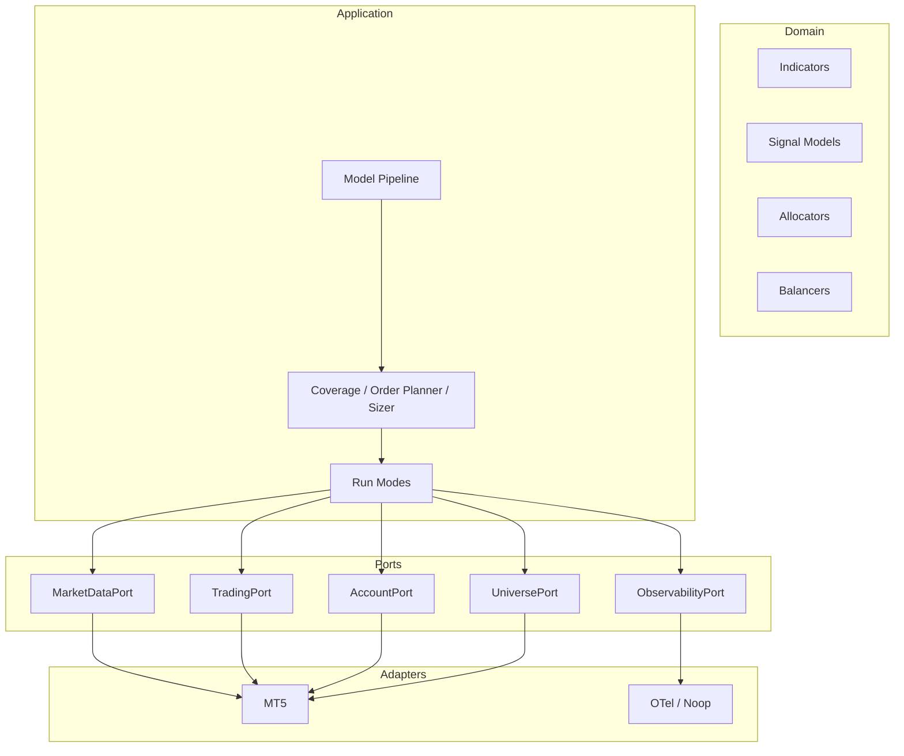

# Architecture Overview

Audience: engineers and tech leads.
Goal: explain system boundaries, critical flow, and extensibility points.

## Purpose

Tycherion runs an algorithmic trading loop using hexagonal architecture: strategy logic stays isolated from MT5 and observability infrastructure.

## Layer Boundaries

- Domain: indicators, models, allocators, balancers, portfolio entities.
- Application: pipeline orchestration, scheduling, plugin discovery, order planning.
- Ports: abstract contracts (`MarketDataPort`, `TradingPort`, `AccountPort`, `UniversePort`, `ObservabilityPort`).
- Adapters: concrete integrations (MT5 and OTel/Noop).

## System Diagram

Diagram source: [docs/diagrams/system_overview.mmd](../diagrams/system_overview.mmd)

## Critical Flow

1. Coverage chooses symbols.
2. Pipeline computes indicators and model decisions.
3. Allocator and balancer derive rebalance instructions.
4. Order planner converts weights into broker-compatible volume.
5. Trader executes or simulates orders.
6. Observability records each critical step.

## Extension Points

- Add plugin modules in `domain/*` with `@register_*` decorators.
- Add run modes in `application/runmodes/` and select via config.
- Add adapters by implementing the related port.

## Failure Model

- Symbol-level failures are contained and observable.
- Adapter failures surface as loop exceptions and can trigger rollback to safe config.

## Related Decisions

- [ADR-0001 Observability Naming](./decisions/adr-0001-observability-naming.md)
- [ADR-0002 Canonical Config Paths](./decisions/adr-0002-canonical-config-paths.md)
- [ADR-0003 Plugin Resolution Rules](./decisions/adr-0003-plugin-resolution-rules.md)

## Links

- Next: [Pipeline Architecture](./pipeline.md)
- See also: [Observability Architecture](./observability.md)
