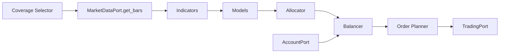

# Pipeline Architecture

Audience: strategy and platform engineers.
Goal: document stage contracts and operational implications.

## Purpose

The pipeline transforms market data into executable orders through deterministic stage interfaces.

## Pipeline Diagram

Diagram source: [docs/diagrams/run_loop.mmd](../diagrams/run_loop.mmd)

## Stage Contracts

- Coverage: returns a symbol list from `application.coverage.*`.
- Data: returns OHLCV DataFrame by symbol and time window.
- Indicators: return `IndicatorOutput(score, features)`.
- Models: return `ModelDecision(side, weight, confidence)`.
- Allocator: returns `TargetAllocation(weights)`.
- Balancer: returns `RebalanceInstruction[]` using `application.portfolio.threshold_weight`.
- Order planner: returns broker-ready orders with valid volume constraints.

## Drop and Safety Behavior

- Stage `drop_threshold` can drop non-held symbols early.
- Held symbols are preserved even below threshold to avoid blind exits.
- Loop-level failures are observable and recoverable by configuration rollback.

## Performance Controls

- Coverage size and `lookback_days` dominate cycle cost.
- Threshold tuning controls execution frequency and churn.

## Related Decisions

- [ADR-0002 Canonical Config Paths](./decisions/adr-0002-canonical-config-paths.md)
- [ADR-0003 Plugin Resolution Rules](./decisions/adr-0003-plugin-resolution-rules.md)

## Links

- Next: [Pipeline Tuning](../guides/pipeline-tuning.md)
- See also: [Configuration Reference](../reference/configuration.md)
