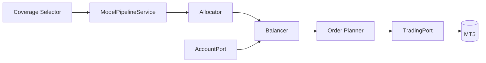

# Operations

Audience: operators and on-call developers.
Goal: run the live loop safely, monitor health, and recover from failures quickly.

## Expected Outcome

- Loop runs with stable cycle time.
- No unexpected order churn.
- Observability signals are available for diagnosis.

## Prerequisites

- Valid MT5 credentials.
- Config reviewed in `application.*` and `trading.*`.
- Observability configured (`observability.*`).

## Critical Config Paths

- `application.schedule.run_forever`
- `application.schedule.interval_seconds`
- `application.portfolio.threshold_weight`
- `trading.dry_run`
- `trading.require_demo`

## Runtime Flow

Diagram source: [docs/diagrams/run_loop.mmd](../diagrams/run_loop.mmd)

## Validation

- Loop starts and emits pipeline observability signals.
- Symbol drops are within expected range.
- Rebalance frequency is acceptable for the current market regime.
- No repeated `run.loop_exception` events.

## Common Mitigations

- Churn too high: increase `application.portfolio.threshold_weight`.
- Cycle latency high: reduce coverage and/or `lookback_days`.
- Missing market data: validate symbols and MT5 connectivity.

## Rollback

1. Set `trading.dry_run=true`.
2. Set `application.schedule.run_forever=false` and run one cycle.
3. Revert recent config changes and retest from baseline.

## Escalation

- Open an incident if observability signals are absent for more than 5 minutes in production.
- Escalate if repeated loop exceptions persist after one rollback cycle.

## Links

- Next: [Troubleshooting](./troubleshooting.md)
- See also: [Observability Runbook](../runbooks/observability.md)
- See also: [MT5 Connectivity and Auth Runbook](../runbooks/mt5-connectivity-auth.md)
- See also: [Order Execution Failures Runbook](../runbooks/order-execution-failures.md)
